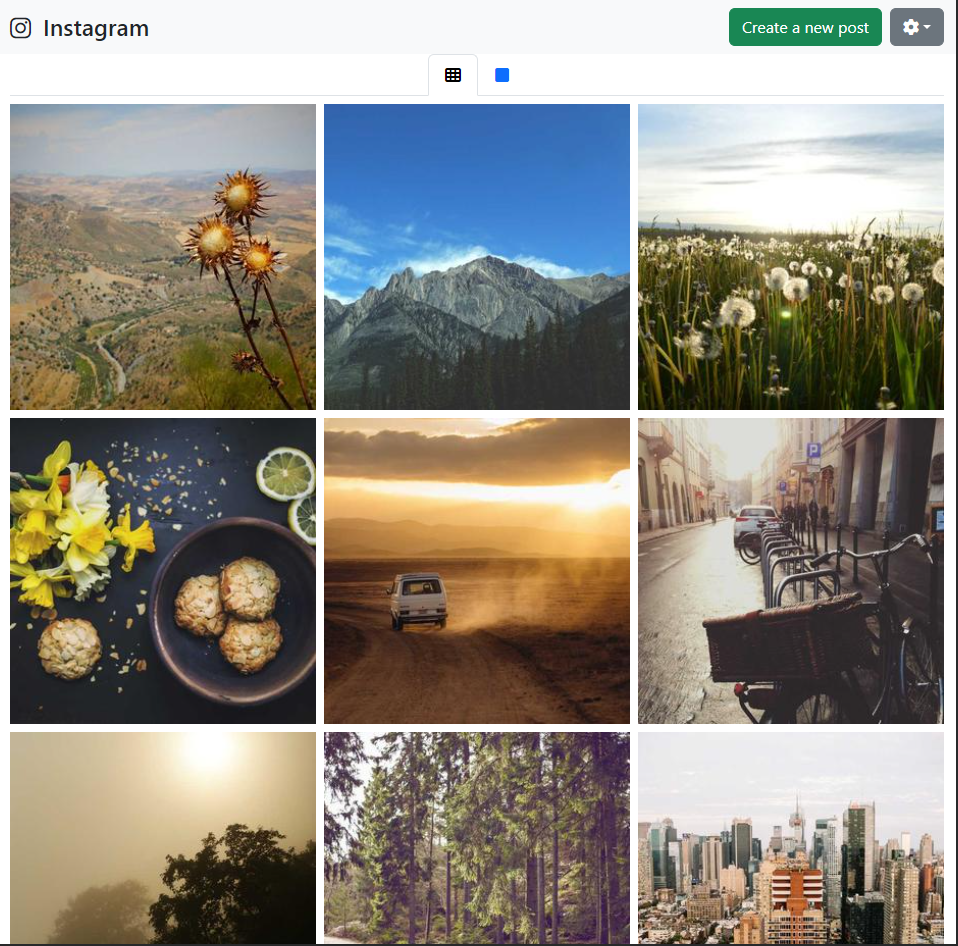
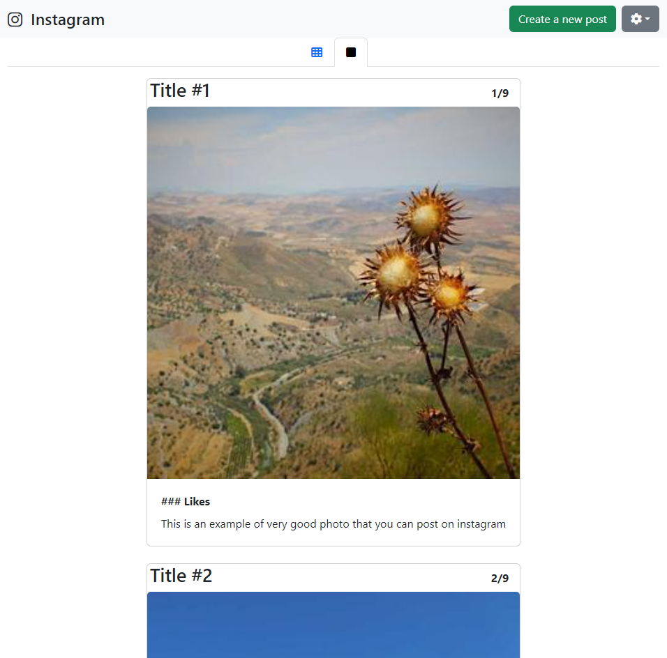
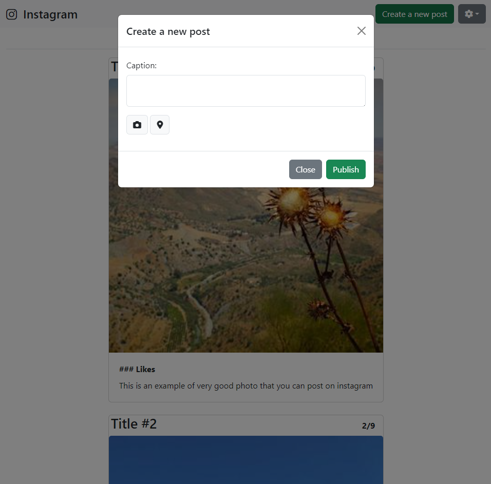
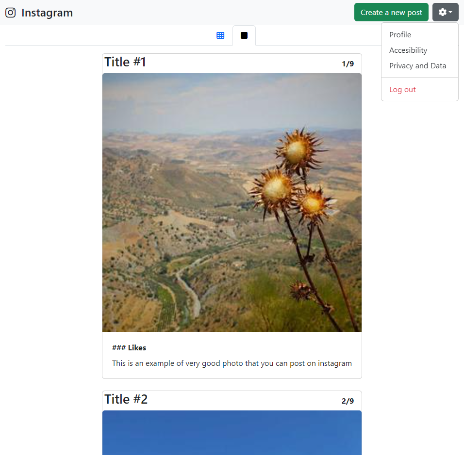
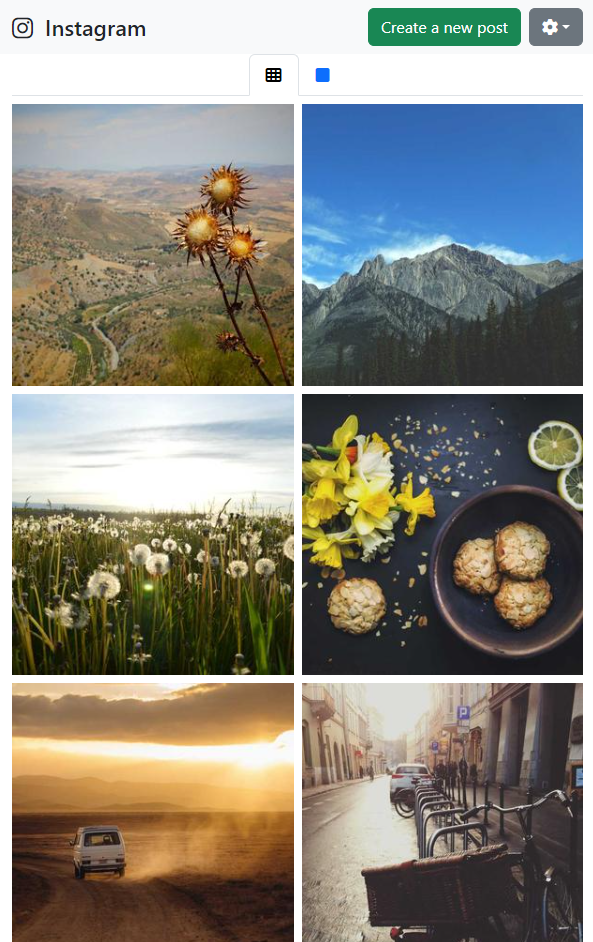

# Instagram Photo Feed Clone (Bootstrap)

Este es un proyecto de práctica que replica la interfaz de usuario de Instagram utilizando **HTML5**, **CSS3 (Custom Properties)** y **Bootstrap 5**. El objetivo principal fue dominar el sistema de grillas, componentes interactivos como Modals y Tabs, y el manejo de diseño responsivo.

## 🚀 Características

- **Diseño Responsivo:** Layout adaptativo que cambia de una cuadrícula de 3 columnas (PC) a 2 (Tablet) y 1 (Móvil).
- **Selector de Vista:** Alternancia entre vista de "Feed de Cuadrícula" y "Vista de Desplazamiento" usando Bootstrap Tabs.
- **Creación de Post:** Modal funcional integrado con atributos de accesibilidad.
- **Scroll Estable:** Implementación de `scrollbar-gutter: stable` para evitar saltos visuales en el layout.
- **Menú de Configuración:** Dropdown alineado dinámicamente.

## 🛠️ Tecnologías utilizadas

- [Bootstrap 5](https://getbootstrap.com/) - Framework de UI.
- [FontAwesome](https://fontawesome.com/) - Iconografía profesional.
- [Lorem Picsum](https://picsum.photos/) - Imágenes de marcador de posición.
- CSS3 con enfoque en **Flexbox**.

## 📸 Capturas de Pantalla

## 📸 Screenshots

| Vista Grid | Vista Feed | Vista Modal (PC) |
| :---: | :---: | :---: |
|  |  |  |

| Dropdown | Vista Tablet | Vista Phone |
| :---: | :---: | :---: |
|  |  |  |

